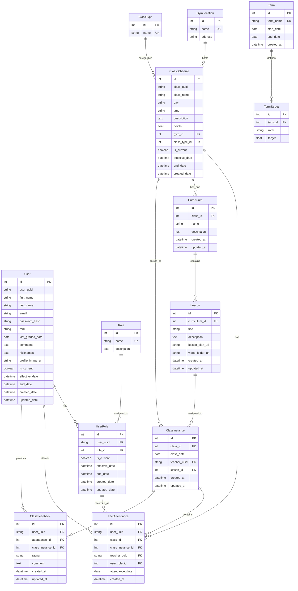

# AGENTS.MD - CKB Tracker Development Guide

## Project Overview
**CKB Tracker** is an attendance tracking application for martial arts classes. Built with FastAPI backend, SQLAlchemy ORM, SQLite database, and Streamlit frontend.

**Tech Stack:**
- Backend: FastAPI 0.127.0+ with Uvicorn
- Database: SQLAlchemy 2.0+ with SQLite
- Frontend: Streamlit 1.52.2+
- Validation: Pydantic v2 (with email support)
- Auth: Passlib with Argon2
- Photo Storage: Cloudinary

## Operational Guidelines
Before moving from one task to the next, you must verify changes by running the relevant test suite (npm test) or by using the terminal to check the output/logs. Do not assume code works just because it compiles. Develop tests as you work on developing features, to ensure a full suite of tests, and that testing can be conducted and is successful after every feature add or change. 

## Definition of Done
"A task is only 'Done' once it has been: 1. Written, 2. Linted, 3. Verified via terminal output, 4. tested by relevant test cases."

## Build, Run & Test Commands

### Environment Setup
```bash
# Create virtual environment (Python 3.12+)
python -m venv .venv

# Activate virtual environment
.venv\Scripts\activate  # Windows
source .venv/bin/activate  # Unix/Mac

# Install dependencies
pip install -e .
```

### Running the Application
```bash
# Start FastAPI backend (port 8000)
uvicorn app.main:app --reload

# Start Streamlit frontend (port 8501)
streamlit run Attendance.py
```

### Database Operations
```bash
# Reset database (drops all tables and recreates)
python reset_db.py

# Seed with complete test data
python seed_complete_data.py
```

### Testing
The project now has a comprehensive test suite. Run tests with:
```bash
# Install pytest first
pip install pytest pytest-cov

# Run all tests
pytest

# Run specific test file
pytest tests/test_models.py

# Run specific test function
pytest tests/test_models.py::test_user_creation

# Run with coverage
pytest --cov=app tests/
```

## Project Structure
```
ckb_tracker/
├── app/
│   ├── __init__.py
│   ├── main.py              # FastAPI app + all routes
│   ├── models.py            # SQLAlchemy models
│   ├── schemas.py           # Pydantic schemas
│   ├── database.py          # DB connection & session
│   ├── auth.py              # JWT and password hashing
│   ├── config.py            # Application configuration
│   ├── routers/             # API route modules
│   │   ├── users.py
│   │   ├── classes.py
│   │   ├── attendance.py
│   │   ├── terms.py
│   │   ├── feedback.py
│   │   └── auth.py
│   └── services/            # External service integrations
│       └── cloudinary_service.py
├── assets/                  # UI styling assets
│   ├── style.css            # Main component styles
│   ├── dark-theme.css       # Dark mode color palette
│   └── light-theme.css      # Light mode color palette
├── pages/                   # Streamlit additional pages
│   ├── 2_Analytics.py
│   ├── 3_Settings.py
│   └── 4_Teacher.py
├── static/
│   └── profile_pics/        # User profile images (local fallback)
├── tests/                   # Test suite
│   ├── test_smoke.py
│   ├── test_scd_constraint_fix.py
│   └── ...
├── Attendance.py            # Main Streamlit app
├── reset_db.py              # Database reset utility
├── seed_complete_data.py    # Complete test data seeder
├── seed_users.py            # Basic user seeder
├── pyproject.toml           # Dependencies
├── test.db                  # SQLite database
├── AGENTS.md                # This file - AI development guide
└── README.md                # User-facing documentation
```

## Data Model

### Entity Relationship Diagram



### Key Constraints
- **User**: Composite unique constraint on (user_uuid, is_current) for SCD Type 2 versioning
- **FactAttendance**: Unique constraint on (user_uuid, class_id, attendance_date)
- **ClassInstance**: Unique constraint on (class_id, class_date)
- **Curriculum**: Unique constraint on class_id (one curriculum per class)
- **ClassFeedback**: Unique constraint on attendance_id (one feedback per attendance)

## Code Style Guidelines

### Import Order
Follow this order with blank lines between groups:
1. Standard library imports
2. Third-party imports (FastAPI, SQLAlchemy, Pydantic, etc.)
3. Local imports (from app import ...)

**Example:**
```python
import shutil
from pathlib import Path
from typing import Optional, List
from datetime import datetime, timezone, date

from fastapi import FastAPI, UploadFile, File, Form, Depends, HTTPException
from sqlalchemy.orm import Session, joinedload
from pydantic import BaseModel, EmailStr

from app import models, database, schemas
from .database import get_db
```

### Type Hints
- **Always** use type hints for function parameters and return values
- Use `Optional[T]` for nullable fields
- Use `List[T]` from typing for list types (or `list[T]` for Python 3.9+)
- Pydantic models automatically validate types

**Example:**
```python
def create_user(
    first_name: str,
    last_name: str,
    email: str,
    rank: Optional[str] = None,
    db: Session = Depends(get_db)
) -> schemas.UserResponse:
    pass
```

### Naming Conventions
- **Variables/Functions:** `snake_case` (e.g., `user_uuid`, `get_users()`)
- **Classes:** `PascalCase` (e.g., `User`, `FactAttendance`, `UserResponse`)
- **Constants:** `UPPER_SNAKE_CASE` (e.g., `BASE_URL`, `UPLOAD_DIR`)
- **Database Tables:** `snake_case` via `__tablename__` (e.g., "users", "term_targets")
- **Private/Internal:** Prefix with `_` (e.g., `_helper_function`)

### Database Patterns

#### Slowly Changing Dimensions (SCD Type 2)
This app uses SCD Type 2 for Users and Classes:
```python
# Required fields for SCD Type 2
is_current = Column(Boolean, default=True)
effective_date = Column(DateTime, default=datetime.now(timezone.utc))
end_date = Column(DateTime, nullable=True)
created_date = Column(DateTime)  # Original creation
updated_date = Column(DateTime, onupdate=datetime.now(timezone.utc))
```

#### UUID Anchors
- Use `user_uuid` and `class_uuid` as stable identifiers
- `id` is auto-incrementing primary key for each version
- Foreign keys reference UUIDs, not IDs

#### Update Pattern (SCD Type 2)
```python
# 1. Find current record
old_record = db.query(Model).filter(
    Model.uuid == uuid,
    Model.is_current == True
).first()

# 2. Expire old record
old_record.is_current = False
old_record.end_date = datetime.now(timezone.utc)

# 3. Create new version
new_version = Model(
    uuid=uuid,  # Keep same anchor
    is_current=True,
    effective_date=datetime.now(timezone.utc),
    created_date=old_record.created_date,  # Preserve original
    # ... updated fields
)
db.add(new_version)
db.commit()
```

### Pydantic Schemas (v2)
- Use `BaseModel` from `pydantic`
- Use `field_validator` decorator (NOT `@validator` from v1)
- Set `Config.from_attributes = True` for ORM models
- Use `EmailStr` for email validation (requires `pydantic[email]`)

**Example:**
```python
from pydantic import BaseModel, EmailStr, field_validator

class UserCreate(BaseModel):
    first_name: str
    email: EmailStr
    
    class Config:
        from_attributes = True

    @field_validator('email')
    @classmethod
    def email_must_be_lowercase(cls, v):
        return v.lower()
```

### Error Handling
- Use `HTTPException` for API errors
- Use `IntegrityError` from SQLAlchemy for constraint violations
- Always rollback on database errors
- Provide meaningful error messages

**Example:**
```python
from fastapi import HTTPException
from sqlalchemy.exc import IntegrityError

try:
    db.add(new_record)
    db.commit()
except IntegrityError:
    db.rollback()
    raise HTTPException(
        status_code=400,
        detail="User is already checked into this class for today."
    )
```

### DateTime Handling
- **Always** use timezone-aware datetimes: `datetime.now(timezone.utc)`
- Use `Date` type for date-only fields (attendance_date, term dates)
- Use `DateTime` for timestamps
- Parse string dates with `dateutil.parser.parse()`

### FastAPI Endpoints

#### Response Models
Always specify `response_model`:
```python
@app.get("/users/", response_model=List[schemas.UserResponse])
def get_users(db: Session = Depends(get_db)):
    return db.query(models.User).all()
```

#### Form Data with Files
Use `Form(...)` and `File(...)`:
```python
@app.post("/users/")
def create_user(
    first_name: str = Form(...),
    email: str = Form(...),
    file: Optional[UploadFile] = File(None),
    db: Session = Depends(get_db)
):
    pass
```

#### Query Filters
Always filter by `is_current=True` for SCD Type 2 tables:
```python
db.query(models.User).filter(models.User.is_current == True).all()
```

## Database Models

### Core Entities
1. **User** - Members with SCD Type 2 versioning
2. **Role** - Fixed role types (Student, Teacher, Admin)
3. **UserRole** - Many-to-many user-role assignments with SCD Type 2 versioning
4. **ClassSchedule** - Classes with SCD Type 2 versioning
5. **ClassInstance** - Specific class occurrence (class + date) with teacher and lesson info
6. **FactAttendance** - Attendance fact table linked to ClassInstances
7. **Term** - Training terms/semesters
8. **TermTarget** - Performance targets per rank per term
9. **GymLocation** - Training locations
10. **ClassType** - Class categories (Gi, No-Gi, etc.)
11. **Curriculum** - Collection of lessons for a class
12. **Lesson** - Reusable lesson content (title, description, URLs)
13. **ClassFeedback** - Student feedback for attended classes

### Role System Architecture

**Overview:** The application implements a role-based system for tracking user permissions and responsibilities with complete historical tracking.

**Three Fixed Roles:**
- **Student** (Default) - Assigned automatically on user creation
- **Teacher** - Instructors who teach classes
- **Admin** - Administrators with full access (future RBAC implementation)

**Key Design Principles:**
- Many-to-many relationship: Users can have multiple roles simultaneously
- Historical tracking: All role assignments/removals are tracked with SCD Type 2
- Teacher tracking: Attendance records capture which teacher taught each class
- Default behavior: New users automatically receive Student role

**Database Schema:**

```python
# Role Table (Static reference)
class Role(Base):
    id = Integer (PK)
    name = String (Unique: Student, Teacher, Admin)
    description = Text

# UserRole Table (SCD Type 2 junction table)
class UserRole(Base):
    id = Integer (PK)
    user_uuid = String (FK → users.user_uuid)
    role_id = Integer (FK → roles.id)
    is_current = Boolean (Indexed)
    effective_date = DateTime
    end_date = DateTime (Nullable)
    created_date = DateTime
    updated_date = DateTime

# FactAttendance (Enhanced with role tracking)
class FactAttendance(Base):
    id = Integer (PK)
    user_uuid = String (FK → users.user_uuid) # Student attending
    class_id = Integer (FK → classes.id)
    teacher_uuid = String (FK → users.user_uuid) # Teacher who taught
    user_role_id = Integer (FK → user_roles.id) # Role at time of attendance
    attendance_date = Date
    created_at = DateTime
    UNIQUE(user_uuid, class_id, attendance_date)
```

**Role Assignment Flow:**

1. **User Creation:**
   ```python
   # Automatically assigns Student role
   POST /users/ → Creates user → Assigns Student role
   ```

2. **Role Management (Settings Page Only):**
   ```python
   # Get current roles
   GET /roles/user/{user_uuid}
   
   # Update roles (SCD Type 2 pattern)
   PUT /roles/user/{user_uuid}
   Body: {"role_ids": [1, 2]}  # Assign Student + Teacher
   
   # View role history
   GET /roles/user/{user_uuid}/history
   ```

3. **Attendance Check-In:**
   ```python
   # Always records as Student, includes optional teacher
   POST /attendance/
   Body: {
       "user_uuid": "student-uuid",
       "class_id": 1,
       "attendance_date": "2026-01-31",
       "teacher_uuid": "teacher-uuid"  # Optional
   }
   ```

**Role Update Pattern (SCD Type 2):**

```python
# Example: Change user from Student to Teacher
# 1. Get current roles
current_roles = db.query(UserRole).filter(
    UserRole.user_uuid == uuid,
    UserRole.is_current == True
).all()

# 2. Expire removed roles
for role in current_roles:
    if role.role_id not in new_role_ids:
        role.is_current = False
        role.end_date = datetime.now(timezone.utc)

# 3. Add new roles
for role_id in new_role_ids:
    if role_id not in current_role_ids:
        new_assignment = UserRole(
            user_uuid=uuid,
            role_id=role_id,
            is_current=True,
            effective_date=datetime.now(timezone.utc),
            created_date=datetime.now(timezone.utc),
        )
        db.add(new_assignment)
```

**Analytics & Reporting:**

- **Student Analytics:** Tracks attendance, points, targets (existing functionality)
- **Teacher Analytics:** New view showing:
  - Classes taught
  - Student counts per class
  - Teaching history over time
  - Accessible via: `GET /attendance/teacher/{teacher_uuid}/classes`

**Frontend Integration:**

1. **Attendance Page (`Attendance.py`):**
   - Teacher selection dropdown (fetches users with Teacher role)
   - Optional field - not required for check-in
   
2. **Settings Page (`pages/3_Settings.py`):**
   - Role management section per user
   - Multi-select checkboxes for role assignment
   - Role history viewer (collapsible)
   
3. **Analytics Page (`pages/2_Analytics.py`):**
   - Automatic role detection
   - Switches between Student/Teacher analytics views
   - Radio button selector if user has both roles

**API Endpoints:**

```
GET    /roles/                          # List all roles
GET    /roles/user/{user_uuid}          # Get user's current roles
GET    /roles/user/{user_uuid}/history  # Get role history
PUT    /roles/user/{user_uuid}          # Update user roles
GET    /roles/users/by-role/{role_name} # Get all users with role
GET    /attendance/teacher/{uuid}/classes # Teacher analytics
```

### ClassInstance (Lessons) Architecture

**Overview:** The application implements a lesson management system to track lesson plans, video resources, and teacher assignments for each specific class occurrence.

**Key Concept:**
- **ClassSchedule**: Represents a recurring class (e.g., "Fundamentals 1 - Monday 18:00")
- **ClassInstance**: Represents a specific occurrence of a class on a particular date (e.g., "Fundamentals 1 on 2026-01-31")
- **Lesson Data**: Attached to ClassInstance (title, lesson plan URL, video folder URL)
- **Teacher Assignment**: Now at ClassInstance level (one teacher per class occurrence)

**Why ClassInstance?**
- Separates "scheduled class" from "class happening on a date"
- Allows different lesson plans for the same recurring class
- Enables teacher assignment at class level (not per-student)
- Supports curriculum progression tracking
- Auto-created when first student checks in (if not pre-created by admin)

**Database Schema:**

```python
class ClassInstance(Base):
    __tablename__ = "class_instances"
    
    id = Integer (PK)
    class_id = Integer (FK → classes.id, NOT NULL, Indexed)
    class_date = Date (NOT NULL, Indexed)
    teacher_uuid = String (FK → users.user_uuid, Nullable)
    lesson_id = Integer (FK → lessons.id, Nullable, Indexed)
    
    created_at = DateTime
    updated_at = DateTime
    
    UNIQUE(class_id, class_date)  # One instance per class per day
```

**FactAttendance Integration:**

```python
class FactAttendance(Base):
    # ... existing fields ...
    class_instance_id = Integer (FK → class_instances.id, Nullable, Indexed)
    teacher_uuid = String (Deprecated - use class_instance.teacher_uuid)
    
    # Relationship
    class_instance = relationship("ClassInstance")
```

**Data Flow:**

1. **Attendance Check-in:**
   - User checks in via Attendance page
   - Backend finds or auto-creates ClassInstance for (class_id, date)
   - Creates FactAttendance record linked to ClassInstance
   - Multiple students in same class share one ClassInstance

2. **Lesson Management (Admin):**
   - Admin goes to Settings → Lessons tab
   - Selects class + date, adds lesson info (title, URLs)
   - Creates or updates ClassInstance
   - Can pre-create for future classes or update past classes

3. **Teacher View:**
   - Teacher goes to Teacher page
   - Selects class + date
   - Sees student roster AND lesson information
   - Links to lesson plan and video folder displayed

**Lesson Management Features:**
- **Create/Update Lessons**: Settings page → Lessons tab
- **View Lessons**: Teacher page (read-only for teachers)
- **URL Validation**: Supports Google Drive, Dropbox, any valid HTTP/HTTPS URL
- **Optional Fields**: All lesson fields (title, URLs) are optional
- **Teacher Assignment**: Per class instance, affects all students in that class
- **Auto-Creation**: ClassInstance created automatically on first check-in if not exists

**API Endpoints:**

```
POST   /class-instances/              # Create/update class instance (upsert)
GET    /class-instances/              # List all instances (filters: class_id, date range)
GET    /class-instances/{id}          # Get specific instance by ID
GET    /class-instances/by-date/      # Get instance by class_id + class_date
PUT    /class-instances/{id}          # Update lesson information
DELETE /class-instances/{id}          # Delete instance (fails if attendance exists)
```

**Frontend Integration:**

1. **Settings Page (`pages/3_Settings.py`):**
   - New "📚 Lessons" tab
   - Form: Select class + date + teacher + lesson info
   - Table: View all lessons with filters (class, date range)
   - Actions: Edit, Delete lessons
   - Admin-only access (existing Settings auth)

2. **Teacher Page (`pages/4_Teacher.py`):**
   - After student roster section
   - "📚 Lesson Information" section
   - Displays: Lesson title, lesson plan button, video folder button
   - Shows "No lesson available" if not created
   - Read-only for teachers

3. **Attendance Page (`Attendance.py`):**
   - No changes needed (teacher selection removed)
   - Check-in auto-creates ClassInstance behind the scenes

### Teacher Assignment Workflow

**Overview:** Teachers are assigned at the ClassInstance level (one teacher per class occurrence), not per individual student attendance record. This feature enables both active teaching assignments and administrative corrections.

**Key Design:**
- `class_instances.teacher_uuid` (FK → users.user_uuid, Nullable) - **Primary** teacher field
- `attendance.teacher_uuid` (Deprecated) - Legacy field, replaced by class_instance relationship
- Teacher assignments can be made before students check in (pre-assignment)
- All students in a class automatically reference the teacher via ClassInstance

**Assignment Flows:**

#### 1. Teacher Dashboard (Primary Flow - Active Teaching)

**Purpose:** Teachers assign themselves (or others) to classes they are actively teaching.

**Location:** `pages/4_Teacher.py`

**User Journey:**
1. Teacher opens Teacher Dashboard
2. Selects class from dropdown
3. Selects date (defaults to today)
4. Teacher dropdown pre-populated if already assigned (fetched from ClassInstance)
5. Selects teacher from dropdown (filtered to only Teacher role users)
6. Clicks "✅ Assign {teacher name} to All Students" button
7. System makes **single API call** to ClassInstance:
   - If ClassInstance exists: `PUT /class-instances/{id}` with `{"teacher_uuid": uuid}`
   - If not exists: `POST /class-instances/` creating new instance
8. Success toast notification appears
9. Page refreshes showing updated teacher in metrics
10. All students in roster automatically linked to teacher

**Key Features:**
- Pre-fetches ClassInstance to show current teacher
- Works even with no students checked in (pre-assignment)
- Efficient single API call (not looping through students)
- Shows teacher in "Current Teacher" metric
- Toast notification for better UX
- Optimized lesson info display (reuses fetched ClassInstance)

**Code Flow:**
```python
# Fetch ClassInstance on page load
GET /class-instances/by-date/?class_id={id}&class_date={date}

# On button click - update or create
if class_instance_exists:
    PUT /class-instances/{instance_id}
    Body: {"teacher_uuid": "selected-uuid"}
else:
    POST /class-instances/
    Body: {
        "class_id": class_id,
        "class_date": "2026-02-01",
        "teacher_uuid": "selected-uuid",
        "lesson_id": null
    }
```

#### 2. Settings Page (Admin Flow - Corrections/Management)

**Purpose:** Admins manage teacher assignments after the fact, including updates and removals.

**Location:** `pages/3_Settings.py` → Lessons tab → "👨‍🏫 Teacher Assignments" subtab

**Features:**

**A. Assignment Form:**
- Class dropdown (all classes)
- Date picker (any date - past, present, future)
- Teacher dropdown (filtered to Teacher role users)
- "💾 Save Teacher Assignment" button
- Creates or updates ClassInstance via API (upsert pattern)

**B. Assignments Table:**
- Columns: Class | Date | Teacher | Lesson | (Actions)
- Filters:
  - Class dropdown (filter by specific class or all)
  - Teacher dropdown (filter by specific teacher or all)
  - Date range (from/to date pickers)
- Metrics display:
  - Total Instances
  - Teachers Assigned (count)
  - Unique Teachers (distinct count)
- Shows "Not Assigned" for null teachers
- Read-only display (editing via expander)

**C. Edit/Remove Interface:**
- Expander: "✏️ Edit Teacher Assignment"
- Select class instance from dropdown (formatted as "Class - Date")
- Shows current teacher name
- Form to update teacher (dropdown + button)
- "🗑️ Remove Teacher Assignment" button (sets teacher_uuid to None)

**User Journey:**
1. Admin opens Settings → Lessons → Teacher Assignments
2. Views table of all current assignments with filters
3. To assign/update:
   - Fills form: class, date, teacher
   - Clicks "Save" button
   - System creates or updates ClassInstance
4. To edit existing:
   - Opens "Edit" expander
   - Selects instance from dropdown
   - Updates teacher or removes assignment
5. Table refreshes showing changes

**Code Flow:**
```python
# Fetch all instances with filters
GET /class-instances/
Params: {
    class_id: (optional),
    teacher_uuid: (optional),
    start_date: "2026-01-01",
    end_date: "2026-02-01"
}

# Assign teacher (form submission)
# Check if exists
GET /class-instances/by-date/?class_id={id}&class_date={date}

if exists:
    PUT /class-instances/{id}
    Body: {"teacher_uuid": "new-uuid" or null}
else:
    POST /class-instances/
    Body: {full instance data with teacher_uuid}

# Remove teacher (button click)
PUT /class-instances/{id}
Body: {"teacher_uuid": null}
```

**Validation:**
- **Frontend:** Only users with Teacher role appear in dropdown
  - Fetched via: `GET /roles/users/by-role/Teacher`
- **Backend:** Teacher role validated when updating (attendance.py lines 291-306)
- **Optional Field:** teacher_uuid allows NULL (no teacher assigned)

**API Endpoints:**

```python
# Get teachers list
GET /roles/users/by-role/Teacher
Response: [
    {"user_uuid": "uuid", "first_name": "John", "last_name": "Doe", ...},
    ...
]

# Get ClassInstance (includes teacher info via join)
GET /class-instances/by-date/?class_id={id}&class_date={date}
Response: {
    "id": 1,
    "class_id": 1,
    "class_date": "2026-02-01",
    "teacher_uuid": "uuid",
    "teacher_name": "John Doe",  # Populated from join
    "lesson_id": null,
    "lesson_title": null,
    ...
}

# Create ClassInstance with teacher (upsert pattern)
POST /class-instances/
Body: {
    "class_id": 1,
    "class_date": "2026-02-01",
    "teacher_uuid": "uuid-here",
    "lesson_id": null
}

# Update teacher assignment
PUT /class-instances/{instance_id}
Body: {
    "teacher_uuid": "new-uuid"  # or null to remove
}

# Query with filters (Settings table)
GET /class-instances/
Params: {
    class_id: 1,  # optional
    teacher_uuid: "uuid",  # optional
    start_date: "2026-01-01",  # optional
    end_date: "2026-02-01"  # optional
}
Response: [
    {
        "id": 1,
        "class_name": "Fundamentals 1",  # Join field
        "class_date": "2026-02-01",
        "teacher_name": "John Doe",  # Join field
        "lesson_title": "Guard Passing",  # Join field
        ...
    },
    ...
]
```

**Edge Cases & Handling:**

1. **Deleted Teacher User:**
   - ClassInstance.teacher_uuid becomes dangling reference
   - UI shows "Unknown Teacher" or "Not Assigned"
   - No database cascade (preserves historical data)

2. **No Students Checked In:**
   - Teacher assignment still allowed (pre-assignment)
   - ClassInstance created without attendance records
   - When students check in later, they link to existing instance

3. **Multiple Simultaneous Updates:**
   - Last write wins at database level
   - No locking mechanism (acceptable for this use case)
   - Unlikely scenario in practice

4. **Future Date Assignment:**
   - Fully supported (pre-assignment for upcoming classes)
   - ClassInstance created in advance
   - Visible in Settings table immediately

**Database Verification:**

```sql
-- Check teacher assignment
SELECT 
    ci.id,
    ci.class_date,
    ci.teacher_uuid,
    u.first_name || ' ' || u.last_name as teacher_name
FROM class_instances ci
LEFT JOIN users u ON ci.teacher_uuid = u.user_uuid AND u.is_current = 1
WHERE ci.class_id = ?;

-- Verify attendance links to instance
SELECT 
    a.id,
    a.user_uuid,
    a.class_instance_id,
    ci.teacher_uuid as instance_teacher
FROM attendance a
JOIN class_instances ci ON a.class_instance_id = ci.id
WHERE a.class_id = ? AND a.attendance_date = ?;
```

**Testing Checklist:**

**Teacher Dashboard:**
- [ ] Dropdown pre-populates with current teacher
- [ ] Assignment works with no students (pre-assignment)
- [ ] Assignment updates existing ClassInstance
- [ ] Toast notification appears on success
- [ ] Current teacher shows in metrics
- [ ] Only Teacher role users in dropdown

**Settings Page:**
- [ ] Table displays all assignments with correct columns
- [ ] Filters work (class, teacher, date range)
- [ ] Metrics calculate correctly
- [ ] Assignment form creates/updates ClassInstance
- [ ] Edit expander allows changing teacher
- [ ] Remove button sets teacher_uuid to null
- [ ] Teacher column shows in lesson assignments table

**Backend:**
- [ ] ClassInstance.teacher_uuid persists correctly
- [ ] Attendance records reference correct instance
- [ ] API responses include teacher_name (join field)
- [ ] Teacher role validation works

**URL Validation:**
- Pydantic `HttpUrl` type validates URLs
- Accepts: `http://`, `https://` protocols
- Supports: Google Drive, Dropbox, OneDrive, any web URL
- Frontend: Shows helpful hints/examples

**Teacher Assignment Migration:**
- **Old**: `teacher_uuid` in FactAttendance (per-student)
- **New**: `teacher_uuid` in ClassInstance (per-class occurrence)
- **Benefit**: Teachers teach classes, not individual students
- **Backward Compatibility**: Old `teacher_uuid` field kept in FactAttendance but deprecated

### Curriculum Management Architecture

**Overview:** The application implements a comprehensive curriculum management system that allows admins to organize lessons into structured curricula and assign them to class instances.

**Key Concepts:**
- **Curriculum**: A collection of lessons for a specific class (1:1 relationship with ClassSchedule)
- **Lesson**: A reusable unit of instruction within a curriculum (title, description, URLs)
- **Curriculum-Lesson Assignment**: Lessons linked to class instances for tracking progression

**Why Curriculum Management?**
- Organize training into structured learning paths
- Track curriculum progression over time
- Reuse lesson content across multiple class dates
- Centralize lesson plans and video resources
- Enable systematic skill development tracking

**Database Schema:**

```python
class Curriculum(Base):
    __tablename__ = "curricula"
    
    id = Integer (PK)
    class_id = Integer (FK → classes.id, NOT NULL, Unique, Indexed)
    name = String(200, NOT NULL)
    description = Text (Nullable)
    created_at = DateTime
    updated_at = DateTime
    
    # Relationships
    class_schedule = relationship("ClassSchedule")
    lessons = relationship("Lesson", back_populates="curriculum", cascade="all, delete-orphan")

class Lesson(Base):
    __tablename__ = "lessons"
    
    id = Integer (PK)
    curriculum_id = Integer (FK → curricula.id, NOT NULL, Indexed)
    title = String(200, NOT NULL)
    description = Text (Nullable)
    lesson_plan_url = String(500, Nullable)  # Validated as HttpUrl
    video_folder_url = String(500, Nullable)  # Validated as HttpUrl
    created_at = DateTime
    updated_at = DateTime
    
    # Relationships
    curriculum = relationship("Curriculum", back_populates="lessons")

# ClassInstance updated to reference lessons
class ClassInstance(Base):
    lesson_id = Integer (FK → lessons.id, Nullable, Indexed)
    lesson = relationship("Lesson")
```

**Data Flow:**

1. **Curriculum Creation:**
   - Admin creates curriculum for a class (Settings → Curricula tab)
   - Name auto-generated from class name if not provided
   - One curriculum per class (enforced at database level)

2. **Lesson Management:**
   - Admin adds lessons to curriculum (Settings → Lesson Library tab)
   - Lessons include title, description, lesson plan URL, video folder URL
   - URLs validated for proper format (HttpUrl)
   - Multiple lessons per curriculum

3. **Lesson Assignment:**
   - Admin assigns lesson to class instance on specific date
   - Links lesson to ClassInstance record
   - Visible to teachers via Teacher page

4. **Teacher View:**
   - Teachers see assigned lesson for their classes
   - Access lesson plan and video folder links
   - View student roster for class occurrence

**Curriculum Workflow:**

```python
# 1. Create curriculum for class
POST /curricula/
Body: {
    "class_id": 1,
    "name": "Fundamentals 1 Curriculum",  # Optional, auto-generated
    "description": "Core techniques for beginners"
}

# 2. Add lessons to curriculum
POST /lessons/
Body: {
    "curriculum_id": 1,
    "title": "Guard Passing Fundamentals",
    "description": "Learn basic guard passing techniques",
    "lesson_plan_url": "https://docs.google.com/document/d/abc123",
    "video_folder_url": "https://drive.google.com/drive/folders/xyz789"
}

# 3. Assign lesson to class instance
POST /class-instances/
Body: {
    "class_id": 1,
    "class_date": "2026-02-01",
    "lesson_id": 1,
    "teacher_uuid": "teacher-uuid"
}

# 4. Query lessons by curriculum
GET /lessons/?curriculum_id=1

# 5. Update lesson details
PUT /lessons/{lesson_id}
Body: {
    "title": "Updated Title",
    "video_folder_url": "https://drive.google.com/updated"
}
```

**Frontend Integration:**

1. **Settings Page (`pages/3_Settings.py`):**
   - **📖 Curricula Tab**:
     - Create curriculum for classes without one
     - Auto-generates name as "[Class Name] Curriculum"
     - Edit/delete curriculum (with cascade protection)
     - View all curricula in table
   
   - **📝 Lesson Library Tab**:
     - Create lessons within curriculum context
     - Add title, description, lesson plan URL, video folder URL
     - Filter lessons by curriculum
     - Edit/delete lessons
     - Validates URLs (Google Drive, Dropbox, any HTTP/HTTPS)
   
   - **📅 Assign to Dates Tab**:
     - Assign lessons to specific class instance dates
     - Select class, date, lesson, and teacher
     - View assignments in table format

2. **Teacher Page (`pages/4_Teacher.py`):**
   - After student roster section
   - "📚 Lesson Information" section
   - Displays: Lesson title, lesson plan button, video folder button
   - Shows "No lesson available" if not assigned
   - Read-only for teachers

**API Endpoints:**

```
POST   /curricula/                     # Create curriculum
GET    /curricula/                     # List all curricula (filter by class_id)
GET    /curricula/{id}                 # Get curriculum by ID
PUT    /curricula/{id}                 # Update curriculum
DELETE /curricula/{id}                 # Delete curriculum (cascades to lessons)

POST   /lessons/                       # Create lesson
GET    /lessons/                       # List all lessons (filter by curriculum_id)
GET    /lessons/{id}                   # Get lesson by ID
PUT    /lessons/{id}                   # Update lesson
DELETE /lessons/{id}                   # Delete lesson
```

**URL Validation:**
- Pydantic `HttpUrl` type validates lesson plan and video folder URLs
- Accepts: `http://`, `https://` protocols only
- Supports: Google Drive, Dropbox, OneDrive, any valid web URL
- Frontend: Shows helpful hints and examples
- Backend: Converts HttpUrl objects to strings before database storage

**Key Features:**
- **1:1 Curriculum-Class Relationship**: Each class has exactly one curriculum
- **Cascade Delete**: Deleting curriculum removes all associated lessons
- **Auto-Name Generation**: Curriculum name auto-generated from class name if not provided
- **URL Validation**: Ensures lesson plan and video URLs are valid
- **Reusable Lessons**: Lessons can be assigned to multiple class instances
- **Historical Tracking**: Created/updated timestamps for audit trail

**Test Coverage:**
- `tests/test_curricula.py`: 14 tests covering curriculum CRUD operations
- `tests/test_lessons.py`: 16 tests covering lesson CRUD operations
- `tests/test_curriculum_integration.py`: 8 integration tests for complete workflow

### Photo Upload Architecture

**Overview:** The application integrates with Cloudinary for profile photo storage, supporting upload, update, and deletion operations with SCD Type 2 versioning.

**Key Features:**
- Cloud-based photo storage via Cloudinary
- Support for file upload and camera capture
- Automatic image processing (resizing, format conversion)
- SCD Type 2 versioning for photo updates
- Photo deletion with Cloudinary cleanup

**Database Schema:**

```python
class User(Base):
    # ... other fields ...
    profile_image_url = Column(String(500), nullable=True)
    # Composite constraint allows SCD versioning
    __table_args__ = (
        UniqueConstraint("user_uuid", "is_current", name="uix_user_current"),
    )
```

**API Endpoints:**

```
POST /users/{user_uuid}/photo    # Upload/update photo
DELETE /users/{user_uuid}/photo  # Delete photo
```

**Frontend Integration:**

1. **Attendance Page (`Attendance.py`):**
   - Photo upload during user creation
   - File upload or camera capture options
   - Preview before submission

2. **Settings Page (`pages/3_Settings.py`):**
   - Photo management section per user
   - Update existing photo
   - Delete photo
   - Preview current and new photos

**Implementation Notes:**
- Photos stored in Cloudinary with user UUID in path
- Old photos deleted from Cloudinary when updated
- SCD Type 2 versioning creates new user record on photo update
- Composite unique constraint (user_uuid, is_current) enables versioning

### Key Constraints
- `FactAttendance`: Unique constraint on (user_uuid, class_id, attendance_date)
- `ClassInstance`: Unique constraint on (class_id, class_date)
- `Curriculum.class_id`: Unique constraint (one curriculum per class)
- `User`: Composite unique constraint on (user_uuid, is_current) for SCD versioning
- `User.user_uuid`: Stable identifier for user identity
- `ClassSchedule.class_uuid`: Stable identifier for class identity

## Teacher Authentication & Feedback Analytics Feature

**Overview:** The application implements role-based authentication for teachers with JWT tokens and comprehensive feedback analytics for administrators. This feature ensures secure teacher access and provides privacy-conscious feedback management.

### Key Features

1. **Password-Protected User Creation**
   - All users must have passwords (minimum 6 characters)
   - Passwords hashed with Argon2 (via passlib)
   - Frontend and backend validation
   - Created users automatically assigned "Student" role

2. **Teacher Dashboard Authentication**
   - JWT-based session management
   - 5-minute token expiry with rolling window extension
   - Automatic logout on inactivity
   - Only users with "Teacher" role can access

3. **Feedback Privacy Controls**
   - **Teachers:** See anonymous feedback ("Student" only, no names)
   - **Admins:** See all feedback with full student names
   - Privacy enforced at API level

4. **Comprehensive Admin Analytics**
   - View all feedback across all classes and teachers
   - Interactive filters (date range, class, teacher, rating)
   - 4 visualization charts (Plotly)
   - CSV export functionality

### Authentication Architecture

**JWT Token Management:**

```python
# app/auth.py
- create_teacher_token(data, expires_delta) → JWT with 5-min expiry
- verify_teacher_token(token) → Validates and decodes JWT
- extend_teacher_token(token) → Rolling expiry on activity
```

**Session Flow:**

```
1. Teacher Login (pages/4_Teacher.py)
   ↓
2. POST /auth/teacher-login
   - Validates email/password
   - Checks Teacher role in UserRole table
   - Returns JWT token + user info
   ↓
3. Session Storage
   - st.session_state.teacher_token
   - st.session_state.teacher_info
   ↓
4. Activity Monitoring
   - Every page interaction: POST /auth/verify-session
   - If valid: Extend token by 5 minutes
   - If expired: Redirect to login
   ↓
5. Logout
   - Clear session state
   - Redirect to login form
```

### Database Changes

**User Model Update:**
```python
class User(Base):
    password_hash = Column(String(255), nullable=True)  # Argon2 hash
    # Note: nullable=True for backward compatibility
    # All new users require passwords
```

**No new tables added** - Uses existing User, UserRole, ClassFeedback models.

### API Endpoints

**Authentication:**
```
POST   /auth/login                  # Student login with email/password
POST   /auth/teacher-login          # Teacher login with email/password, return JWT
POST   /auth/verify-session         # Verify token, extend expiry
```

**Password Management:**
```
POST   /auth/set-password           # Set or update user password (admin)
GET    /auth/check-password/{uuid}  # Check if user has password set
DELETE /auth/remove-password/{uuid} # Remove user password (admin)
```

**Feedback:**
```
POST   /feedback/                                   # Create feedback (student)
GET    /feedback/user/{uuid}                        # Get user's feedback (student)
GET    /feedback/teacher/{uuid}                     # Teacher's feedback (anonymous)
GET    /feedback/admin/comprehensive-stats          # All feedback (admin view)
```

### Frontend Pages Modified

**1. Attendance.py (Main Page)**
- **Changes:** Added password fields to user creation form
- **Location:** Sidebar "Add New Member" form
- **Fields Added:**
  - Password (type="password", min 6 chars)
  - Confirm Password (validation)
- **Validation:** Frontend checks password match, minimum length
- **API Call:** Includes password in POST /users/ request

**2. pages/4_Teacher.py (Teacher Dashboard)**
- JWT authentication gate
- Class roster with teacher assignment
- Anonymous feedback view
- Lesson information display

**3. pages/3_Settings.py (Admin Settings)**
- Feedback Analytics tab with charts and CSV export
- Photo management section
- Role management section
- Password reset functionality

### Security Considerations

**Password Storage:**
- Hashed with Argon2 (passlib default)
- Never stored in plain text
- Backend validates password on user creation

**JWT Tokens:**
- Secret key auto-generated: `secrets.token_urlsafe(32)`
- Stored in `.env` file (gitignored)
- HS256 algorithm
- 5-minute expiry with rolling extension

**Session Management:**
- Tokens stored in Streamlit session_state (server-side)
- Not exposed to client
- Auto-cleared on logout
- Expired tokens rejected by backend

**Role Verification:**
- Teacher role checked at login
- 403 Forbidden if user lacks Teacher role
- Prevents students from accessing Teacher Dashboard

**Feedback Privacy:**
- API-level enforcement
- Teacher endpoint filters by teacher_uuid
- Admin endpoint requires Settings page authentication
- No student names returned to teacher endpoint

### Configuration

**Environment Variables:**
```bash
# .env file (auto-generated if not exists)
SECRET_KEY=<auto-generated-32-byte-key>
CLOUDINARY_CLOUD_NAME=<cloudinary-cloud-name>
CLOUDINARY_API_KEY=<cloudinary-api-key>
CLOUDINARY_API_SECRET=<cloudinary-api-secret>
```

**Dependencies:**
```toml
python-jose[cryptography]  # JWT token management
cloudinary                 # Photo upload service
```

## Common Pitfalls

1. **Forgetting is_current filter** - Always filter SCD Type 2 tables by `is_current=True`
2. **Using id instead of uuid** - Foreign keys should reference uuid fields, not id
3. **Naive datetimes** - Always use `datetime.now(timezone.utc)`
4. **Pydantic v1 patterns** - This project uses Pydantic v2 (`field_validator` not `@validator`)
5. **Not preserving old data** - When creating new SCD versions, copy fields that shouldn't change
6. **Photo upload constraint** - User model uses composite unique constraint (user_uuid, is_current) to support SCD versioning

## API Conventions

- Base URL: `http://127.0.0.1:8000`
- Use plural nouns: `/users/`, `/classes/`, `/terms/`
- UUID in path: `/users/{user_uuid}`, `/classes/{class_uuid}`
- Filter endpoints: `/attendance/user/{user_uuid}`, `/term-targets/term/{term_id}`
- Return empty lists (not 404) when no results found
- Upsert pattern: POST creates, PUT updates (with SCD versioning)

## Development Workflow

1. **Models First** - Define SQLAlchemy models in `app/models.py`
2. **Schemas Next** - Create Pydantic schemas in `app/schemas.py`
3. **Routes** - Create router in `app/routers/` and include in `app/main.py`
4. **Frontend Integration** - Update Streamlit pages to consume API
5. **Test** - Write tests in `tests/` and run with `pytest`
6. **Verify** - Test via UI and run full test suite

## Related Documentation

- **README.md:** User-facing project documentation
- **API Docs:** http://127.0.0.1:8000/docs (when server running)

---

*Last Updated: February 11, 2026*
